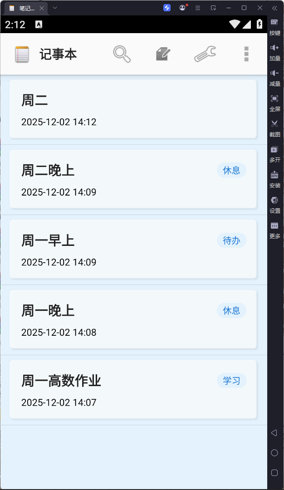
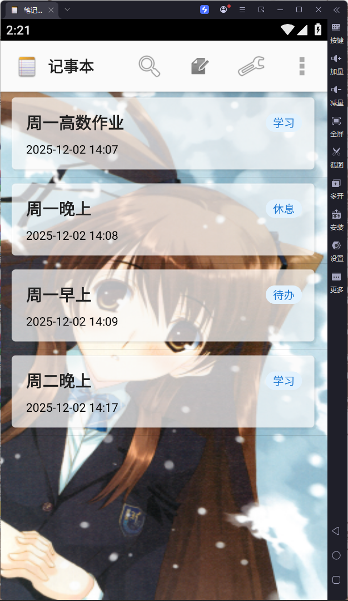
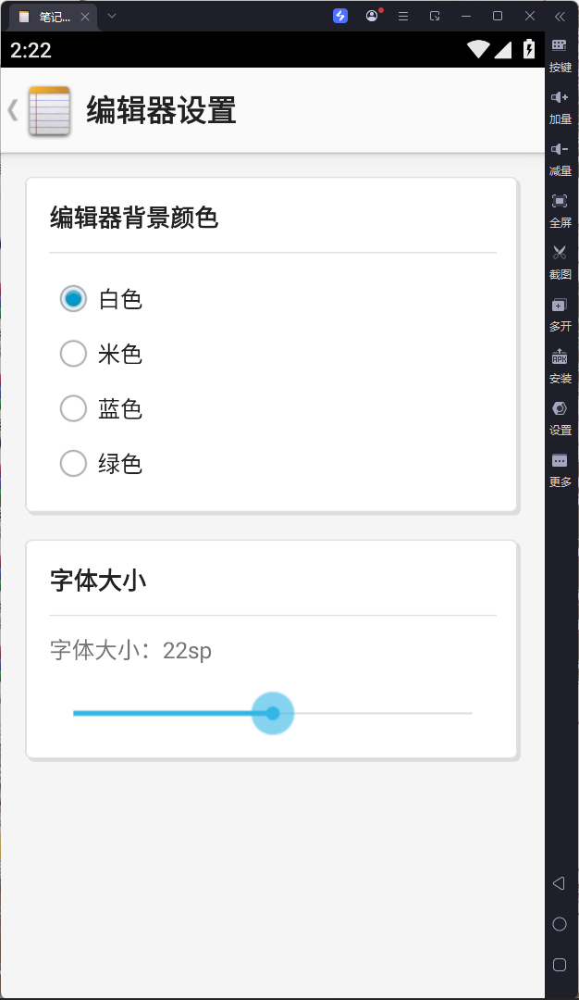
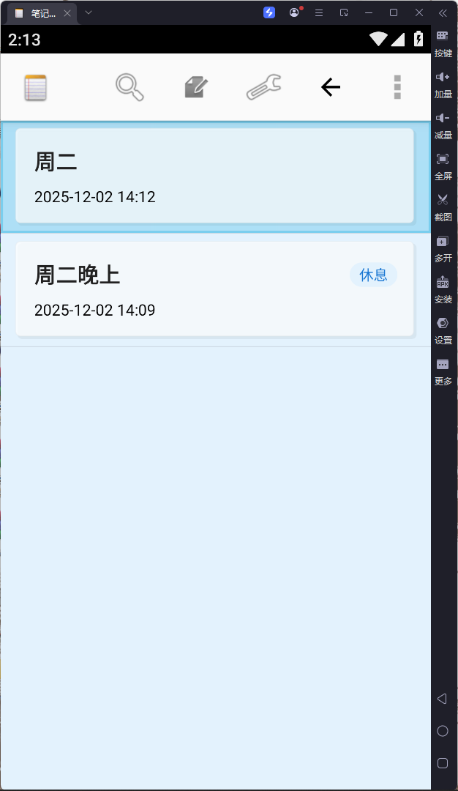
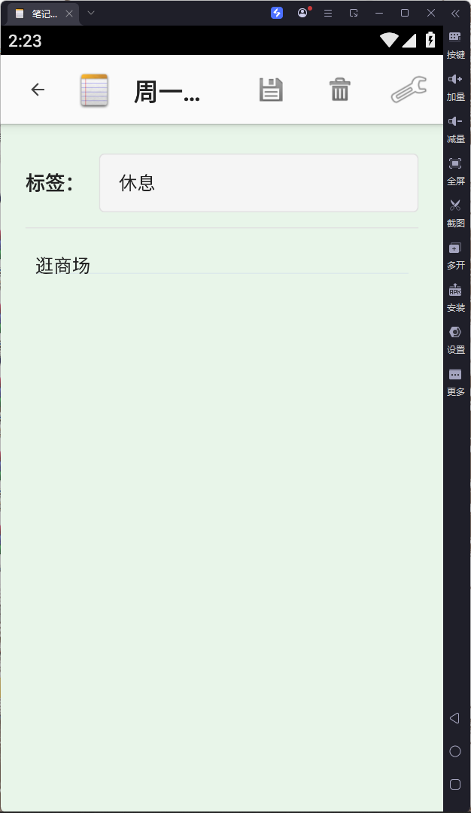
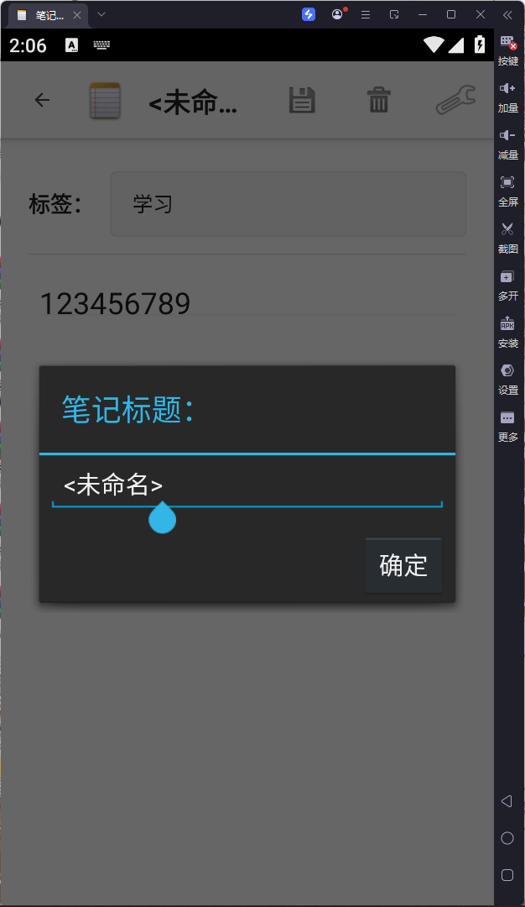
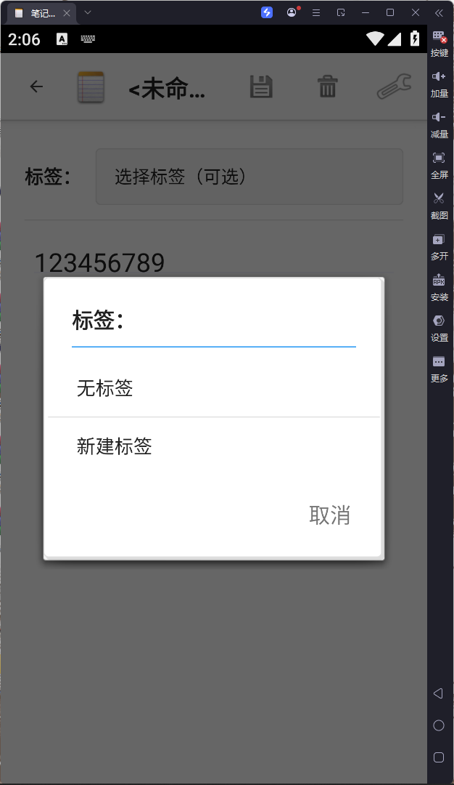
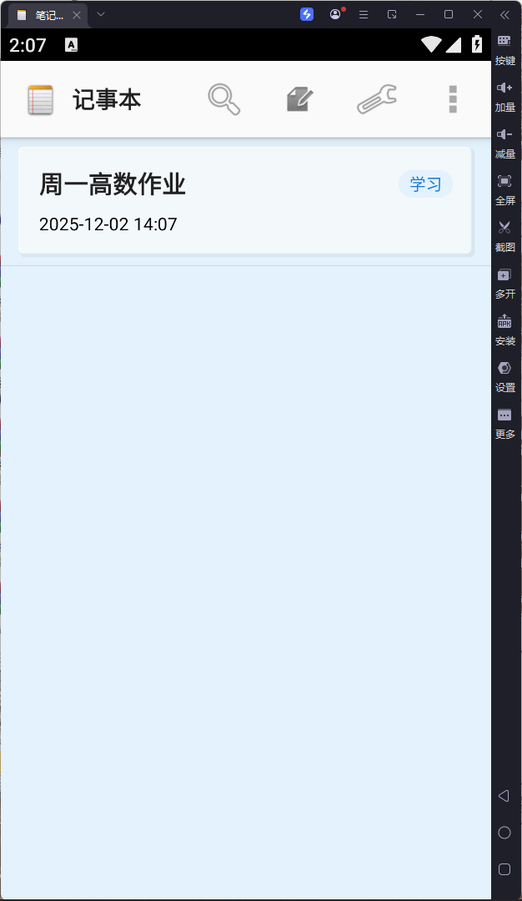
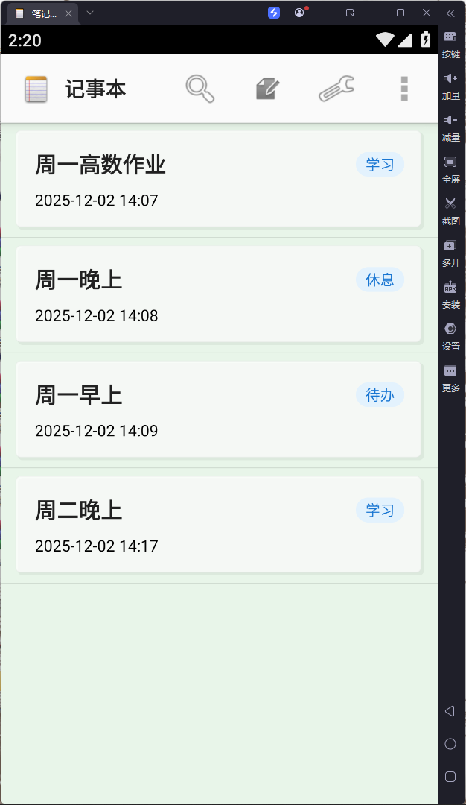

# NotePad - 一款功能丰富的Android笔记应用

## 项目介绍

NotePad是一款基于Android平台的笔记应用，演示了Android数据库操作的基本教程。该应用提供了完整的笔记管理功能，包括创建、编辑、删除笔记，支持标签分类、搜索功能和个性化设置。

## 功能特点

- 📝 **笔记管理**：创建、编辑、删除笔记
- 🔍 **搜索功能**：支持全局搜索和标签内搜索
- 🏷️ **标签分类**：支持标签创建和笔记分类
- 🎨 **个性化定制**：可自定义背景颜色和背景图片
- ⚙️ **排序设置**：支持最新优先和最旧优先排序
- 📱 **手势操作**：左右滑动隐藏/显示列表
- 💾 **数据安全**：自动保存和未保存修改提示
- 🖋️ **编辑器设置**：支持编辑页背景颜色和字体大小调整

## 技术栈

- Java
- Android SDK
- SQLite数据库
- ContentProvider
- CursorAdapter

## 安装和运行

### 环境要求

- Android Studio
- Android SDK
- JDK 8+

### 构建步骤

1. 克隆项目到本地
   ```bash
   git clone https://github.com/yourusername/NotePad.git
   ```

2. 使用Android Studio打开项目

3. 连接Android设备或启动模拟器

4. 点击运行按钮构建并安装应用

### 命令行构建

```bash
./gradlew assembleDebug
```

## 详细使用说明

### 1. 主界面



**界面说明**：
- 顶部自定义ActionBar，显示应用名称
- 笔记列表以卡片形式展示，包含标题、修改时间和标签
- 右上角有添加新笔记的"+"图标
- 支持左右滑动手势隐藏/显示列表

### 2. 创建新笔记

**操作流程**：

1. **进入新建笔记界面**
   - 
   - 操作：点击主界面右上角的"+"图标
   - 效果：进入空白的笔记编辑界面
   - **关键代码**：
     ```java
     // 在NotesList.java中处理添加新笔记
     @Override
     public boolean onOptionsItemSelected(MenuItem item) {
         if (item.getItemId() == R.id.menu_add) {
             startActivity(new Intent(Intent.ACTION_INSERT, getIntent().getData()));
             return true;
         }
         // 其他选项处理...
     }
     ```

2. **输入笔记内容**
   - 
   - 操作：在正文区域输入笔记内容
   - 效果：标题区域显示默认的"无标题"或自动提取的内容
   - **关键代码**：
     ```java
     // 在NoteEditor.java中获取和设置笔记内容
     mText = (EditText) findViewById(R.id.note);
     if (mCursor != null && mCursor.moveToFirst()) {
         String note = mCursor.getString(mCursor.getColumnIndex(NotePad.Notes.COLUMN_NAME_NOTE));
         if (note != null) {
             mText.setTextKeepState(note);
         }
     }
     ```

3. **添加标签**
   - 
   - 操作：点击标签按钮，选择已有标签或创建新标签
   - 效果：标签添加到笔记中
   - **关键代码**：
     ```java
     // 在NoteEditor.java中处理标签设置
     mTagButton = (Button) findViewById(R.id.tag_button);
     if (mTagButton != null) {
         mTagButton.setOnClickListener(new View.OnClickListener() {
             @Override
             public void onClick(View v) {
                 showTagSelectionDialog();
             }
         });
     }
     ```

4. **修改笔记标题**
   - 
   - 操作：点击标题区域，输入新标题
   - 效果：标题更新
   - **关键代码**：
     ```java
     // 在NoteEditor.java中处理标题编辑
     mActionBarTitle = (TextView) customView.findViewById(R.id.actionbar_title);
     if (mActionBarTitle != null) {
         mActionBarTitle.setOnClickListener(new View.OnClickListener() {
             @Override
             public void onClick(View v) {
                 Intent intent = new Intent(TitleEditor.EDIT_TITLE_ACTION);
                 intent.setData(mUri);
                 startActivity(intent);
             }
         });
     }
     ```

5. **保存笔记**
   - 
   - 操作：点击顶部ActionBar的"保存"按钮
   - 效果：笔记保存到数据库，返回主界面
   - **关键代码**：
     ```java
     // 在NoteEditor.java中保存笔记
     @Override
     protected void onPause() {
         super.onPause();
         // 保存笔记到数据库
         ContentValues values = new ContentValues();
         values.put(NotePad.Notes.COLUMN_NAME_NOTE, mText.getText().toString());
         values.put(NotePad.Notes.COLUMN_NAME_MODIFICATION_DATE, System.currentTimeMillis());
         if (mCurrentTag != null) {
             values.put(NotePad.Notes.COLUMN_NAME_TAG, mCurrentTag);
         }
         getContentResolver().update(mUri, values, null, null);
     }
     ```

### 3. 手势操作

#### 3.1 左右滑动显示/隐藏列表

- **向左滑动**：隐藏笔记列表，显示空背景
  - 
  - 操作：在主界面从右向左滑动
  - 效果：笔记列表向左滑出屏幕，只显示背景
  - **关键代码**：
    ```java
    // 在NotesList.java中初始化手势检测器
    gestureDetector = new GestureDetector(this, new GestureDetector.SimpleOnGestureListener() {
        @Override
        public boolean onFling(MotionEvent e1, MotionEvent e2, float velocityX, float velocityY) {
            float deltaX = e2.getX() - e1.getX();
            float deltaY = e2.getY() - e1.getY();
            
            if (Math.abs(deltaX) > Math.abs(deltaY) && Math.abs(deltaX) > SWIPE_MIN_DISTANCE) {
                if (deltaX < 0) {
                    // 左滑 - 隐藏列表
                    hideList();
                    return true;
                }
            }
            return false;
        }
    });
    ```

- **向右滑动**：恢复笔记列表
  - 操作：当列表隐藏时，从左向右滑动
  - 效果：笔记列表平滑滑入屏幕，恢复正常显示
  - **关键代码**：
    ```java
    // 在NotesList.java中处理右滑恢复列表
    @Override
    public boolean onFling(MotionEvent e1, MotionEvent e2, float velocityX, float velocityY) {
        // ... 前面的代码 ...
        if (Math.abs(deltaX) > Math.abs(deltaY) && Math.abs(deltaX) > SWIPE_MIN_DISTANCE) {
            if (deltaX > 0) {
                // 右滑 - 显示列表
                showList();
                return true;
            }
            // ... 左滑处理 ...
        }
        return false;
    }
    
    // 显示列表的方法
    private void showList() {
        if (!isListHidden) {
            return;
        }
        ListView listView = getListView();
        // 动画效果实现...
        listView.setVisibility(View.VISIBLE);
        isListHidden = false;
    }
    ```

### 4. 搜索功能

#### 4.1 全局搜索

- 
- 操作：
  1. 在主界面点击搜索图标
  2. 输入搜索关键词
  3. 系统在所有笔记中搜索
- 效果：显示所有匹配关键词的笔记
- **关键代码**：
  ```java
  // 在NotesList.java中处理搜索意图
  private void handleIntent(Intent intent) {
      if (Intent.ACTION_SEARCH.equals(intent.getAction())) {
          String query = intent.getStringExtra(SearchManager.QUERY);
          if (query != null && !query.isEmpty()) {
              String searchPattern = "%" + query + "%";
              // 全局搜索：在标题、内容和标签中搜索
              mSelection = NotePad.Notes.COLUMN_NAME_TITLE + " LIKE ? OR " + 
                          NotePad.Notes.COLUMN_NAME_NOTE + " LIKE ? OR " +
                          NotePad.Notes.COLUMN_NAME_TAG + " LIKE ?";
              mSelectionArgs = new String[] { searchPattern, searchPattern, searchPattern };
          }
      }
  }
  ```

#### 4.2 标签内搜索

- 
- 操作：
  1. 点击标签进入标签过滤状态
  2. 点击搜索图标
  3. 输入搜索关键词（如"周二"）
- 效果：只在当前标签内搜索，显示匹配结果
- **关键代码**：
  ```java
  // 在NotesList.java中处理标签内搜索
  private void handleIntent(Intent intent) {
      if (Intent.ACTION_SEARCH.equals(intent.getAction())) {
          String query = intent.getStringExtra(SearchManager.QUERY);
          if (query != null && !query.isEmpty()) {
              String searchPattern = "%" + query + "%";
              
              // 如果有当前标签过滤，在标签内搜索
              if (mCurrentTagFilter != null && !mCurrentTagFilter.isEmpty()) {
                  mSelection = "(" + NotePad.Notes.COLUMN_NAME_TITLE + " LIKE ? OR " + 
                              NotePad.Notes.COLUMN_NAME_NOTE + " LIKE ?) AND " +
                              NotePad.Notes.COLUMN_NAME_TAG + " = ?";
                  mSelectionArgs = new String[] { searchPattern, searchPattern, mCurrentTagFilter };
              } else {
                  // 全局搜索逻辑...
              }
          }
      }
  }
  ```

### 5. 设置功能

#### 5.1 排序方式设置

- 
- 操作：
  1. 进入设置界面
  2. 找到"排序方式"选项
  3. 选择"最新优先"或"最旧优先"
- 效果：笔记列表按选择的方式排序
- **关键代码**：
  ```java
  // 在NotesList.java中获取排序方式
  private String getSortOrder() {
      if (prefs == null) {
          return NotePad.Notes.DEFAULT_SORT_ORDER;
      }
      String sortOrderPref = SettingsActivity.getSortOrder(prefs);
      switch (sortOrderPref) {
          case "modified_asc":
              return NotePad.Notes.COLUMN_NAME_MODIFICATION_DATE + " ASC";
          case "modified_desc":
          default:
              return NotePad.Notes.DEFAULT_SORT_ORDER;
      }
  }
  ```

#### 5.2 背景设置

##### 5.2.1 背景颜色更换

- 
- 操作：
  1. 进入设置界面
  2. 点击"背景颜色"选项
  3. 从颜色选择器中选择颜色（白色、米色、蓝色、绿色等）
  4. 系统自动应用所选颜色
- **关键代码**：
  ```java
  // 在NotesList.java中应用背景颜色
  private void applyBackgroundColor() {
      if (prefs == null) {
          return;
      }
      
      String bgColor = SettingsActivity.getBackgroundColor(prefs);
      int colorRes = R.color.bg_white;
      if ("cream".equals(bgColor)) {
          colorRes = R.color.bg_cream;
      } else if ("blue".equals(bgColor)) {
          colorRes = R.color.bg_blue;
      } else if ("green".equals(bgColor)) {
          colorRes = R.color.bg_green;
      }
      int backgroundColor = getResources().getColor(colorRes);
      
      // 应用背景颜色到各个视图
      if (getWindow() != null) {
          getWindow().setBackgroundDrawable(new ColorDrawable(backgroundColor));
      }
      View rootView = findViewById(android.R.id.content);
      if (rootView != null) {
          rootView.setBackgroundColor(backgroundColor);
      }
      ListView listView = getListView();
      if (listView != null) {
          listView.setBackgroundColor(backgroundColor);
      }
  }
  ```

##### 5.2.2 添加背景图片

- 
- 操作：
  1. 进入设置界面
  2. 点击"背景图片"选项
  3. 从相册选择图片
  4. 进入图片裁剪界面，调整裁剪框
  5. 点击"保存"完成裁剪
- 效果：应用背景变为所选图片
- **关键代码**：
  ```java
  // 在NotesList.java中应用背景图片
  private void applyBackgroundColor() {
      // ... 背景颜色代码 ...
      
      // 检查是否设置了背景图片
      String imagePath = prefs.getString(SettingsActivity.PREF_BACKGROUND_IMAGE, null);
      if (imagePath != null && !imagePath.isEmpty()) {
          try {
              File imageFile = new File(imagePath);
              if (imageFile.exists()) {
                  Bitmap bitmap = BitmapFactory.decodeFile(imagePath);
                  BitmapDrawable drawable = new BitmapDrawable(getResources(), bitmap);
                  
                  // 应用背景图片
                  if (getWindow() != null) {
                      getWindow().setBackgroundDrawable(drawable);
                  }
                  View rootView = findViewById(android.R.id.content);
                  if (rootView != null) {
                      rootView.setBackground(drawable);
                  }
                  ListView listView = getListView();
                  if (listView != null) {
                      listView.setBackground(drawable);
                  }
                  return;
              }
          } catch (Exception e) {
              Log.e(TAG, "Error loading background image", e);
          }
      }
      
      // ... 背景颜色默认处理 ...
  }
  ```

### 6. 笔记编辑页设置

- 、
- 操作：
  1. 进入笔记编辑界面
  2. 点击设置图标
  3. 调整编辑页背景颜色
  4. 调整笔记字体大小
- 效果：实时预览并保存设置
- **关键代码**：
  ```java
  // 在NoteEditor.java中应用编辑器设置
  private void applySettings() {
      // 应用背景颜色
      if (mRootLayout != null) {
          String editorBgColor = prefs.getString(SettingsActivity.PREF_EDITOR_BG_COLOR, "white");
          int colorRes = R.color.editor_bg_white;
          if ("cream".equals(editorBgColor)) {
              colorRes = R.color.editor_bg_cream;
          } else if ("blue".equals(editorBgColor)) {
              colorRes = R.color.editor_bg_blue;
          } else if ("green".equals(editorBgColor)) {
              colorRes = R.color.editor_bg_green;
          }
          mRootLayout.setBackgroundColor(getResources().getColor(colorRes));
      }
      
      // 应用字体大小
      if (mText != null) {
          String fontSize = prefs.getString(SettingsActivity.PREF_FONT_SIZE, "medium");
          int textSize = getResources().getDimensionPixelSize(R.dimen.font_size_medium);
          if ("small".equals(fontSize)) {
              textSize = getResources().getDimensionPixelSize(R.dimen.font_size_small);
          } else if ("large".equals(fontSize)) {
              textSize = getResources().getDimensionPixelSize(R.dimen.font_size_large);
          }
          mText.setTextSize(TypedValue.COMPLEX_UNIT_PX, textSize);
      }
  }
  ```

### 7. 删除笔记

- 
- 操作：
  1. 在笔记编辑界面点击删除图标
  2. 弹出删除确认对话框
  3. 确认后删除笔记
- 效果：笔记从数据库中删除，返回主界面
- **关键代码**：
  ```java
  // 在NoteEditor.java中处理删除操作
  @Override
  public boolean onOptionsItemSelected(MenuItem item) {
      if (item.getItemId() == R.id.menu_delete) {
          // 显示删除确认对话框
          new AlertDialog.Builder(this)
                  .setTitle(R.string.dialog_delete_title)
                  .setMessage(R.string.dialog_delete_message)
                  .setPositiveButton(R.string.dialog_delete_confirm, new DialogInterface.OnClickListener() {
                      @Override
                      public void onClick(DialogInterface dialog, int which) {
                          deleteNote();
                      }
                  })
                  .setNegativeButton(R.string.dialog_delete_cancel, null)
                  .show();
          return true;
      }
      // 其他选项处理...
  }
  
  // 执行删除操作
  private void deleteNote() {
      if (mUri != null) {
          getContentResolver().delete(mUri, null, null);
          setResult(RESULT_OK);
          finish();
      }
  }
  ```

### 8. 未保存修改提示

- 、
- 操作场景：在笔记编辑界面修改内容后，未点击保存而点击返回
- 效果：
  - 弹出提示对话框："您有未保存的更改"
  - 提供"保存"和"不保存"选项
  - 点击"保存"：保存更改并返回
  - 点击"不保存"：放弃更改并返回
- **关键代码**：
  ```java
  // 在NoteEditor.java中处理返回按钮
  private void handleBackPressed() {
      // 检查内容是否有变化
      boolean contentChanged = false;
      if (mText != null && mOriginalContent != null) {
          String currentContent = mText.getText().toString();
          contentChanged = !currentContent.equals(mOriginalContent);
      }
      
      // 检查标签是否有变化
      boolean tagChanged = (mCurrentTag != null && !mCurrentTag.equals(mOriginalTag)) ||
                          (mCurrentTag == null && mOriginalTag != null);
      
      if (contentChanged || tagChanged) {
          // 显示未保存修改提示对话框
          new AlertDialog.Builder(this)
                  .setTitle(R.string.dialog_unsaved_title)
                  .setMessage(R.string.dialog_unsaved_message)
                  .setPositiveButton(R.string.dialog_save, new DialogInterface.OnClickListener() {
                      @Override
                      public void onClick(DialogInterface dialog, int which) {
                          // 保存更改
                          onPause(); // 调用onPause()来保存内容
                          finish();
                      }
                  })
                  .setNegativeButton(R.string.dialog_dont_save, new DialogInterface.OnClickListener() {
                      @Override
                      public void onClick(DialogInterface dialog, int which) {
                          // 不保存，直接退出
                          mShouldSkipSave = true; // 设置标志跳过自动保存
                          finish();
                      }
                  })
                  .setCancelable(false)
                  .show();
      } else {
          // 没有变化，直接退出
          finish();
      }
  }
  ```

## 关键代码解析

### 1. ContentProvider实现

```java
public class NotePadProvider extends ContentProvider {
    // 数据库版本
    private static final int DATABASE_VERSION = 2;
    // 数据库名称
    private static final String DATABASE_NAME = "note_pad.db";
    // 表名
    private static final String NOTES_TABLE_NAME = "notes";
    
    // 创建表的SQL语句
    private static final String CREATE_NOTES_TABLE = "CREATE TABLE " + NOTES_TABLE_NAME + " (" +
            NotePad.Notes._ID + " INTEGER PRIMARY KEY AUTOINCREMENT, " +
            NotePad.Notes.COLUMN_NAME_TITLE + " TEXT, " +
            NotePad.Notes.COLUMN_NAME_NOTE + " TEXT, " +
            NotePad.Notes.COLUMN_NAME_CREATE_DATE + " INTEGER, " +
            NotePad.Notes.COLUMN_NAME_MODIFICATION_DATE + " INTEGER, " +
            NotePad.Notes.COLUMN_NAME_TAG + " TEXT" +
            ");";
    
    // 数据库辅助类
    private static class DatabaseHelper extends SQLiteOpenHelper {
        // 构造函数
        DatabaseHelper(Context context) {
            super(context, DATABASE_NAME, null, DATABASE_VERSION);
        }
        
        // 创建数据库
        @Override
        public void onCreate(SQLiteDatabase db) {
            db.execSQL(CREATE_NOTES_TABLE);
        }
        
        // 更新数据库
        @Override
        public void onUpgrade(SQLiteDatabase db, int oldVersion, int newVersion) {
            // 简化版，实际应用中应考虑数据迁移
            db.execSQL("DROP TABLE IF EXISTS " + NOTES_TABLE_NAME);
            onCreate(db);
        }
    }
    
    // 其他ContentProvider方法实现...
}
```

### 2. 手势检测实现

```java
// 初始化手势检测器
gestureDetector = new GestureDetector(this, new GestureDetector.SimpleOnGestureListener() {
    @Override
    public boolean onFling(MotionEvent e1, MotionEvent e2, float velocityX, float velocityY) {
        if (e1 == null || e2 == null) {
            return false;
        }
        
        float deltaX = e2.getX() - e1.getX();
        float deltaY = e2.getY() - e1.getY();
        
        // 检测水平滑动
        if (Math.abs(deltaX) > Math.abs(deltaY) && Math.abs(deltaX) > SWIPE_MIN_DISTANCE) {
            if (Math.abs(velocityX) > SWIPE_THRESHOLD_VELOCITY || Math.abs(deltaX) > SWIPE_MIN_DISTANCE * 2) {
                if (deltaX > 0) {
                    // 右滑 - 显示列表
                    showList();
                    return true;
                } else {
                    // 左滑 - 隐藏列表
                    hideList();
                    return true;
                }
            }
        }
        
        return false;
    }
});
```

### 3. 笔记列表适配器

```java
private SimpleCursorAdapter createNotesAdapter(Cursor cursor) {
    String[] dataColumns = { NotePad.Notes.COLUMN_NAME_TITLE, NotePad.Notes.COLUMN_NAME_MODIFICATION_DATE };
    int[] viewIDs = { android.R.id.text1, android.R.id.text2 };
    
    return new SimpleCursorAdapter(
        this,
        R.layout.noteslist_item,
        cursor,
        dataColumns,
        viewIDs
    ) {
        @Override
        public void setViewText(TextView v, String text) {
            if (v.getId() == android.R.id.text2) {
                try {
                    long timestamp = Long.parseLong(text);
                    Date date = new Date(timestamp);
                    SimpleDateFormat sdf = new SimpleDateFormat("yyyy-MM-dd HH:mm", Locale.getDefault());
                    v.setText(sdf.format(date));
                } catch (NumberFormatException e) {
                    v.setText(text);
                }
            } else {
                super.setViewText(v, text);
            }
        }
        
        // 标签显示和点击处理
        @Override
        public void bindView(View view, Context context, Cursor cursor) {
            super.bindView(view, context, cursor);
            
            // 显示标签并添加点击事件
            TextView tagView = view.findViewById(R.id.tag_text);
            if (tagView != null) {
                String tag = cursor.getString(cursor.getColumnIndex(NotePad.Notes.COLUMN_NAME_TAG));
                if (tag != null && !tag.trim().isEmpty()) {
                    tagView.setText(tag.trim());
                    tagView.setVisibility(View.VISIBLE);
                    tagView.setOnClickListener(v -> filterByTag(tag.trim()));
                } else {
                    tagView.setVisibility(View.GONE);
                }
            }
        }
    };
}
```

## 项目结构

```
app/
├── src/main/
│   ├── java/com/example/android/notepad/
│   │   ├── NotesList.java          # 笔记列表主界面
│   │   ├── NoteEditor.java         # 笔记编辑界面
│   │   ├── NotePadProvider.java    # 数据库内容提供者
│   │   ├── NotePad.java            # 常量定义
│   │   ├── TitleEditor.java        # 标题编辑界面
│   │   ├── SettingsActivity.java   # 设置界面
│   │   ├── EditorSettingsActivity.java # 编辑器设置
│   │   └── ImageCropActivity.java  # 图片裁剪功能
│   └── res/                        # 资源文件
└── build.gradle                    # 构建配置
```

## 数据库设计

### 表结构

| 字段名 | 类型 | 描述 |
|--------|------|------|
| _id | INTEGER | 笔记ID，主键 |
| title | TEXT | 笔记标题 |
| note | TEXT | 笔记内容 |
| created | INTEGER | 创建时间戳 |
| modified | INTEGER | 修改时间戳 |
| tag | TEXT | 笔记标签 |

## 学习价值

这个项目是Android官方的经典示例，适合学习以下内容：

1. Android数据库操作
2. ContentProvider的使用
3. ListView和CursorAdapter的应用
4. 自定义视图和动画
5. 搜索功能实现
6. 手势操作处理
7. 自定义主题和样式

## 贡献指南

欢迎提交Issue和Pull Request！

## 许可证

Apache License 2.0

## 截图展示

### 主界面


### 笔记编辑


### 搜索功能


### 设置界面


### 背景设置


